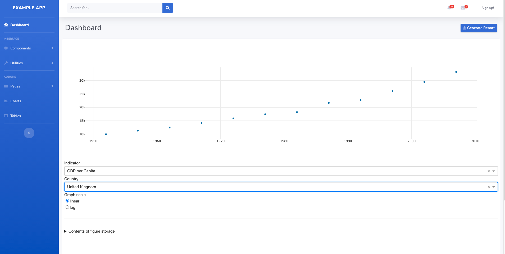
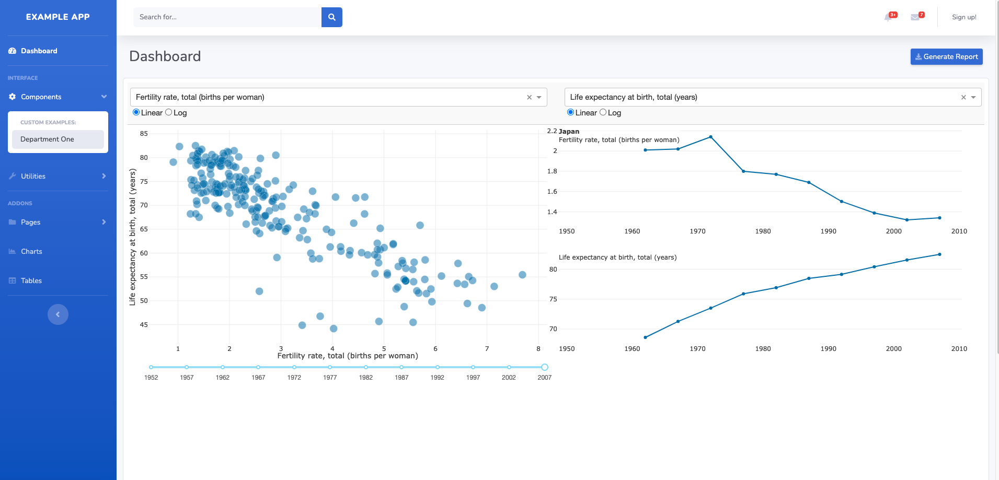
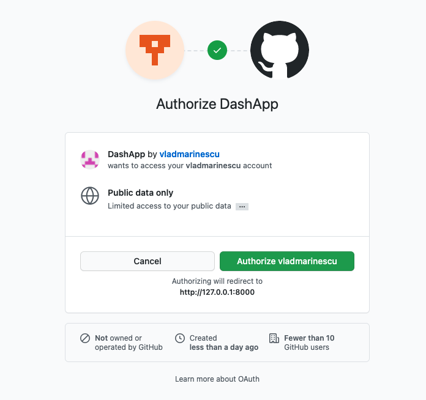

# Plotly Dash & Django application 

### This repository sets up a baseline Django application for creating Plotly dashboards. Using allauth authentication with application (such as GitHub or Google) can be added.

## Purpose: Use the repository to set up an internal dashboard/model monitoring tool.

## Features
1. Plotly dash is integrated with a Redis backend
2. Django app has a MySql backend 
3. The application is dockerized (not production ready)
4. Authentication setup with all-auth (early stages) ([tutorial](https://kodnito.com/posts/django-authentication-github/))

## Pages

### Beside the implemented template, the application comes with two example pages
1. The home page:
   
2. A second example:
   
### And with some extra setup, social-media login
   

## Usage instructions 
1. Clone the repository.
2. Run `docker-compose up`.
3. Enter the backend application `docker-compose exec backend bash`.
4. Run the migration `python manage.py migrate`.
5. Collect the static files `python manage.py collectstatic`.
6. Create a superuser `python manage.py createsuperuser`. You can use it to login to `/admin/`.   
6. You may have to restart the application for everything to work. 

## Key links and tutorials
* [Django Plotly Dash Tutorial](https://www.youtube.com/watch?v=psvU4zwO3Ao)
* [SB-admin-2 Boostrap Template](https://startbootstrap.com/theme/sb-admin-2)